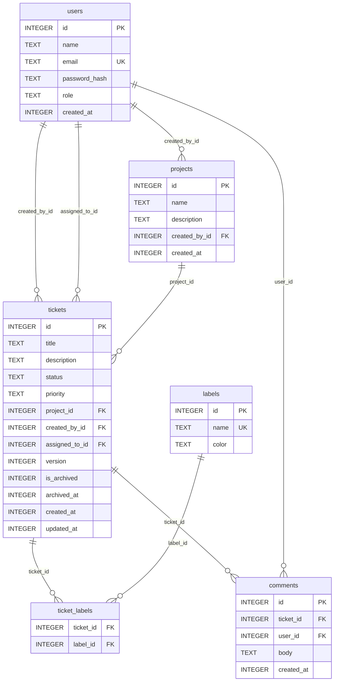

# Base de Datos — Mini Jira

Fuente de verdad: `backend/src/db/schema.ts` (SQLite + Drizzle ORM).

> **Discrepancia:** `docs/init_db.sql` describe un esquema PostgreSQL 16 + Prisma con UUID como PKs, tablas `refresh_tokens` y `ticket_history`, y sin tabla `projects`. El schema operativo es `schema.ts`.

---

## ERD

---

## Tablas

### `users`

| Columna | Tipo | Constraints | Descripción |
|---------|------|-------------|-------------|
| `id` | INTEGER | PK, autoincrement | Identificador único |
| `name` | TEXT | NOT NULL | Nombre visible |
| `email` | TEXT | NOT NULL, UNIQUE | Identificador de login |
| `password_hash` | TEXT | NOT NULL | Hash bcrypt |
| `role` | TEXT | NOT NULL, DEFAULT `'user'` | `'user'` \| `'admin'` |
| `created_at` | INTEGER | NOT NULL, DEFAULT now | Unix epoch (segundos) |

### `projects`

| Columna | Tipo | Constraints | Descripción |
|---------|------|-------------|-------------|
| `id` | INTEGER | PK, autoincrement | Identificador único |
| `name` | TEXT | NOT NULL | Nombre del proyecto |
| `description` | TEXT | nullable | Descripción opcional |
| `created_by_id` | INTEGER | NOT NULL, FK → users.id | Creador del proyecto |
| `created_at` | INTEGER | NOT NULL, DEFAULT now | Unix epoch (segundos) |

### `tickets`

| Columna | Tipo | Constraints | Descripción |
|---------|------|-------------|-------------|
| `id` | INTEGER | PK, autoincrement | Identificador único |
| `title` | TEXT | NOT NULL | Título del ticket |
| `description` | TEXT | nullable | Descripción larga |
| `status` | TEXT | NOT NULL, DEFAULT `'to_do'` | `to_do` \| `in_progress` \| `in_review` \| `done` |
| `priority` | TEXT | NOT NULL, DEFAULT `'medium'` | `low` \| `medium` \| `high` \| `critical` |
| `project_id` | INTEGER | NOT NULL, FK → projects.id | Proyecto al que pertenece |
| `created_by_id` | INTEGER | NOT NULL, FK → users.id | Creador |
| `assigned_to_id` | INTEGER | nullable, FK → users.id | Asignado actual |
| `version` | INTEGER | NOT NULL, DEFAULT `1` | Contador para optimistic locking |
| `is_archived` | INTEGER | NOT NULL, DEFAULT `false` | Soft delete flag |
| `archived_at` | INTEGER | nullable | Timestamp de archivo |
| `created_at` | INTEGER | NOT NULL, DEFAULT now | Unix epoch (segundos) |
| `updated_at` | INTEGER | NOT NULL, DEFAULT now | Unix epoch (segundos) |

### `labels`

| Columna | Tipo | Constraints | Descripción |
|---------|------|-------------|-------------|
| `id` | INTEGER | PK, autoincrement | Identificador único |
| `name` | TEXT | NOT NULL, UNIQUE | Nombre de la etiqueta |
| `color` | TEXT | NOT NULL | Color HEX |

### `ticket_labels` (tabla pivote)

| Columna | Tipo | Constraints | Descripción |
|---------|------|-------------|-------------|
| `ticket_id` | INTEGER | NOT NULL, FK → tickets.id | Ticket |
| `label_id` | INTEGER | NOT NULL, FK → labels.id | Etiqueta |

> PK compuesta: `(ticket_id, label_id)`

### `comments`

| Columna | Tipo | Constraints | Descripción |
|---------|------|-------------|-------------|
| `id` | INTEGER | PK, autoincrement | Identificador único |
| `ticket_id` | INTEGER | NOT NULL, FK → tickets.id | Ticket comentado |
| `user_id` | INTEGER | NOT NULL, FK → users.id | Autor del comentario |
| `body` | TEXT | NOT NULL | Contenido del comentario |
| `created_at` | INTEGER | NOT NULL, DEFAULT now | Unix epoch (segundos) |

---

## Decisiones de Diseño

### Optimistic Locking (campo `version`)
Cada `PATCH /tickets/:id` requiere que el cliente envíe el `version` actual. Si `current.version !== body.version`, la API responde `409 Conflict` con el nombre del usuario que hizo el último cambio. En caso de éxito, se incrementa `version + 1`. Evita bloqueos pesimistas y permite alta concurrencia en el board kanban.

### Soft Delete (campos `is_archived` / `archived_at`)
Los tickets nunca se eliminan físicamente. `PATCH /tickets/:id/archive` activa `is_archived = true` y registra `archived_at`. Esto preserva el historial y permite restauración vía `PATCH /tickets/:id/restore` (solo admin). Las queries estándar filtran `is_archived = false`.

### Timestamps como INTEGER (Unix epoch)
Todos los campos `*_at` almacenan segundos desde epoch como INTEGER. Simplifica comparaciones y ordenación en SQLite, que no tiene tipo nativo `TIMESTAMP`.

### Tabla `projects` (solo en `schema.ts`)
La tabla `projects` existe en el schema operativo Drizzle pero no en `init_db.sql`. Fue añadida en la iteración de gestión de proyectos. Los tickets referencian `project_id` como FK obligatoria.

### AuditLog / `ticket_history` — Pendiente
`init_db.sql` define una tabla `ticket_history` inmutable para auditoría. Esta tabla **no está implementada** en `schema.ts`. Las especificaciones (`docs/specs.md §2.4`) la marcan como deferred para una versión futura.
