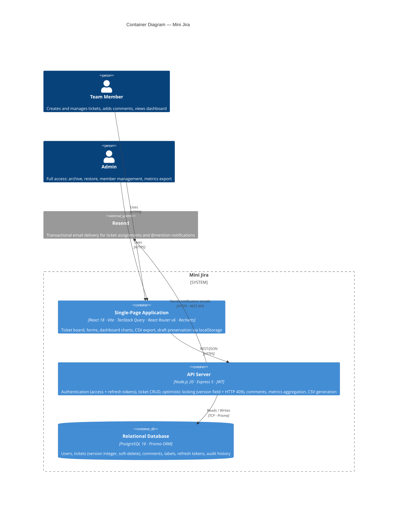

# C4 Container Diagram — Mini Jira

## Diagram

## Notes

| Container | Rationale |
|---|---|
| **SPA** | Single deployable unit — all frontend tech (routing, charts, state) lives here. `localStorage` draft preservation (EC-01) is an internal SPA concern, not a separate container. |
| **API Server** | Owns all business logic: JWT issuance/refresh, optimistic locking, role enforcement, and CSV generation — keeping the SPA thin. |
| **Relational Database** | One DB covers both transactional data and the `version` integer required for optimistic locking. Audit history is retained here per spec §2.4. |
| **Resend (external)** | Crosses the system boundary — the API calls it, but it is not owned by the team. Modeled as `System_Ext`. |
