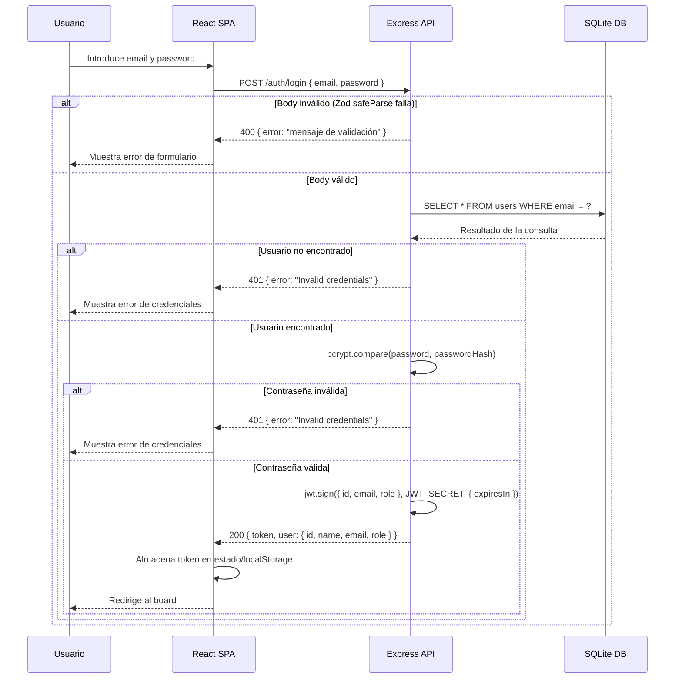
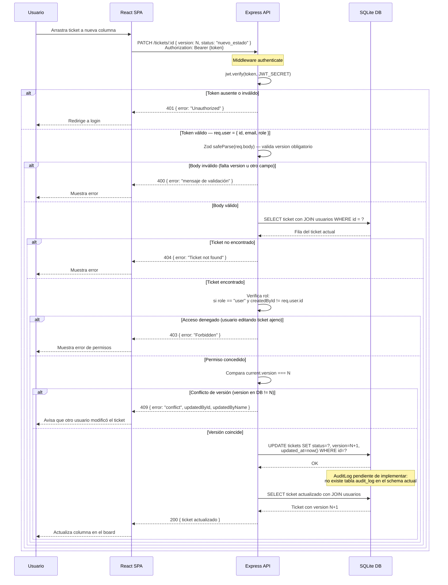
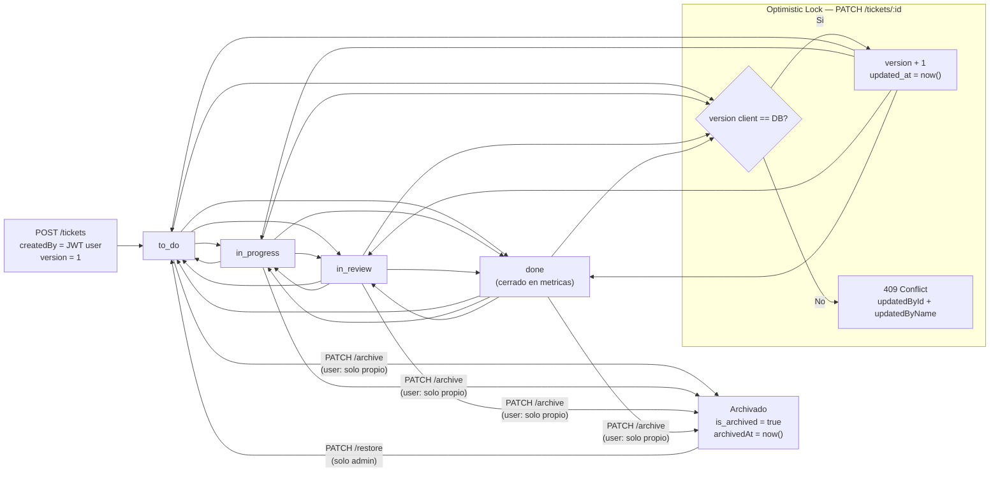

# Diagramas Técnicos — Mini Jira

---

## Diagrama 1 — Flujo de Autenticación JWT

Muestra el ciclo completo de login desde que el usuario introduce sus credenciales hasta que la SPA almacena el token y redirige al board. Refleja fielmente el código de `backend/src/routes/auth.ts`: validación Zod, consulta a SQLite, comparación con bcryptjs y emisión del JWT.

---

## Diagrama 2 — Mover Ticket Entre Columnas (PATCH /tickets/:id)

Detalla el flujo completo para actualizar el estado de un ticket, incluyendo la verificación JWT del middleware `authenticate`, el control de acceso por rol, y el optimistic locking mediante el campo `version`. Refleja el código real de `backend/src/routes/tickets.ts` y `backend/src/middleware/auth.ts`.

> **Nota sobre AuditLog:** La tabla `audit_log` **no existe** en `backend/src/db/schema.ts`. El schema actual define las tablas: `users`, `projects`, `tickets`, `labels`, `ticket_labels` y `comments`. El registro de auditoría está previsto en la arquitectura pero pendiente de implementar.

---

## Diagrama 3 — Ciclo de Vida de un Ticket

Muestra todos los estados posibles de un ticket desde su creación hasta su archivo o restauración. Incluye las transiciones libres entre los 4 estados activos, el mecanismo de optimistic locking (campo `version`) que protege las actualizaciones concurrentes, y el flujo de soft delete mediante archivo y restauración. El estado `done` es el único que computa como "cerrado" en métricas y dashboard.

> **Nota:** El sistema implementa **Optimistic Locking** (no pessimistic). No hay bloqueo de fila en DB; la concurrencia se controla comparando el campo `version` del cliente contra el valor en DB en el momento del PATCH.

