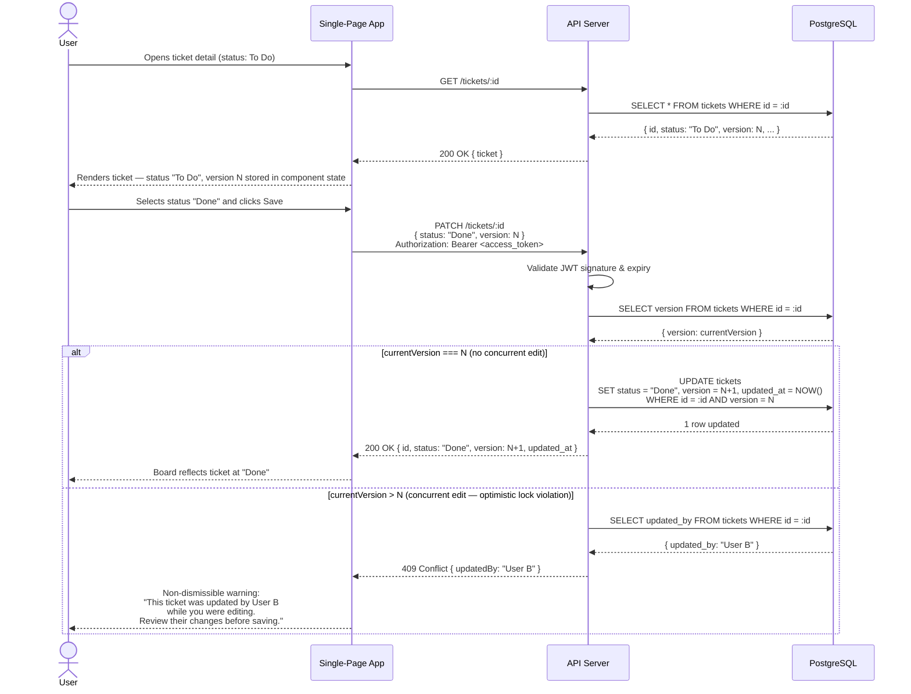

# Sequence Diagram — Move a Ticket from To Do to Done

## Flow

## Notes

| Step | Spec reference |
|---|---|
| Version `N` read on load and held in component state | §2.5 — client sends the version it last read |
| `PATCH` sends `version: N` alongside the change | §2.5 — server compares incoming vs stored version |
| `WHERE id = :id AND version = N` atomic update | Prevents a race between the version check and the write |
| HTTP 409 returned on mismatch | §2.5 — server returns 409 if version has advanced |
| Non-dismissible conflict warning with the other user's name | §2.5 — exact UI requirement |
| No notification email triggered | §2.8 — emails only fire on assignment or @mention, not status change |
